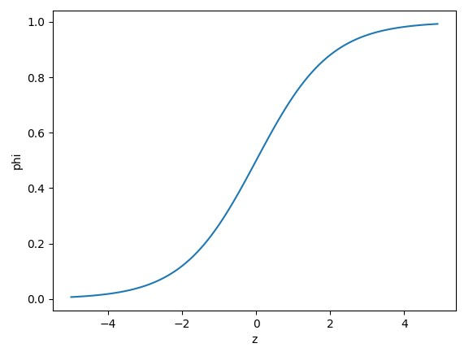

# ML-Logistic Regression

We will discuss about "How can we get the probability of certain class".

Logistic Regression algorithm makes equations which is the best to explain the circumstance like linear regression does.

And it will be look like : 

    z = a x (weight) + b x (length) + c x (diagonal) + d x (height) + e x (width) + f

For binary classification the value of 'z' will be changed by sigmoid function. The sigmoid function makes the value of 'z' between 0 and 1.

Sigmoid function is look like :

On  the other hand, for multiclass classification, the number of 'z' will be the number of classes. 

And, softmax function makes the sum of all the 'z' values ​​equal to 1. 

For more detail, you can see comments in knn_classification.py and logistic.py file.